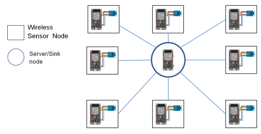

# Device-free-Localization-system-with-ESP32-and-BH1750FVI
   In this repository, Contains the implementation of Device-free Indoor Localization system with two types of sensor which is ESP32 for measuring RSSI in every sensor nodes, and BH1750FVI for measuring illuminance around the room.

